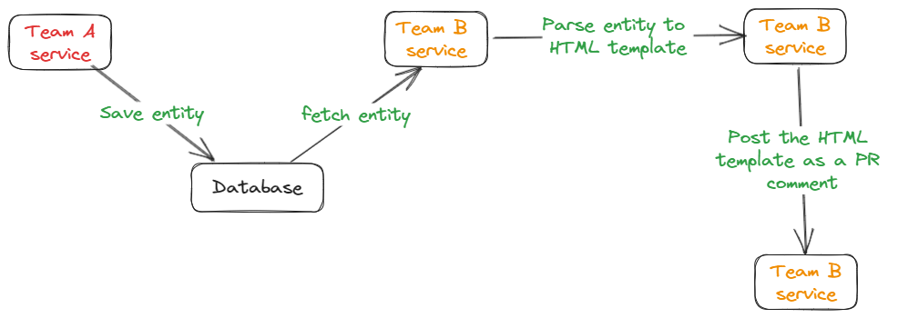
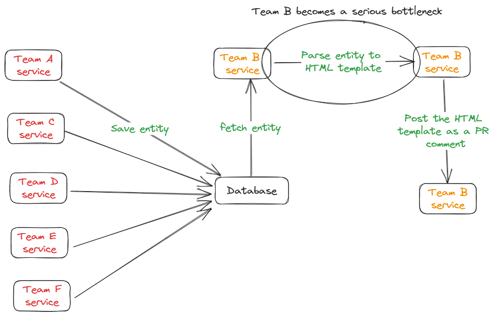
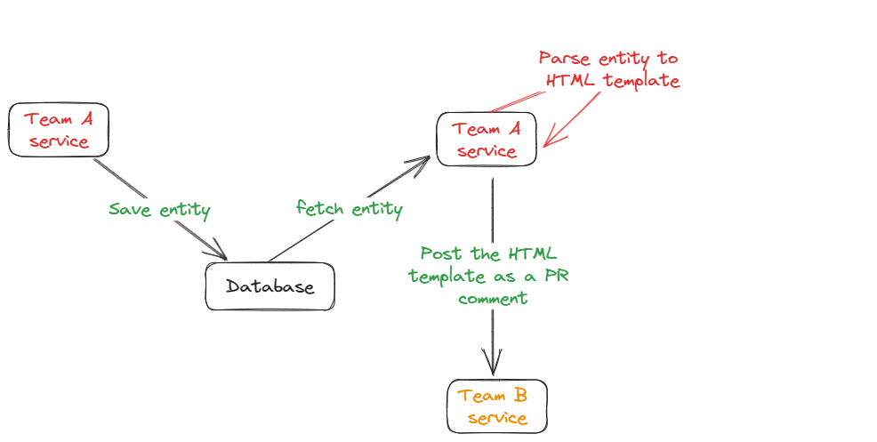

This is a story about how three months of hard work didn't turn out as we hoped, and far from it. It's a look back at what went wrong, and what we learned from it.  
Before we jump into it, you will need some context.

## Context: The Initial Plan
Imagine a system where team A saves an entity to the database, then team B fetches that entity, parses it into an HTML template and posts a PR comment from it.

Now what if instead of a single entity that team A is producing, there are 5 more teams saving different kind of entities which has to appear on PR comments too? team B essentialy has to know how parse each of the entities into the PR comment and if team A wants to make a slight change in the HTML template they are also dependent on team B.

We tried to cut the dependency on team B, by saying that each team that saves an entity to the database, should own the code which parses the entity into an HTML template.

So far so good, we got a plan.

## First Steps: Team B Develops an API
Armed with an action plan, team B got down to business - it was time to develop a new API. This API was to serve as a messenger, accepting an HTML template and delivering it as a comment on the customer's PR.

With the API blueprint ready, team A got a task to start migrating their service to use the new shiny API. At this point the assumption was that it was fairly simple and a design review process wasn't necessary. A single ticket was opened, "make it work".

A developer in team A was assigned the ticket and he estimated it as a week worth of work. But as the days rolled on, one week morphed into two.  
Yet, to everyone's surprise, no red flags were raised. There were no cries of alarm, nothing.

It was now team C's turn in the spotlight, tasked with a similar mission. Still under the impression that a formal design process was unnecessary. 
After all, team A's experience, although time-consuming, was thought to be insightful. "We've got this," they thought. "With all that we've learned, it should be simple."

## The Warning Signs: Complexity and Confusion
A fresh face from team C starts working on a similar task team A had already completed, "make it work like team A did".
Full with confidence, he started sketching out the service, only to find himself digging into uncharted territories of complexity, a far cry from the simplicity he was promised.

Soon, the single task ballooned into an array of tickets, opening avenues for the team to collectively dive into the code. That's when I was roped in.

We huddled up, planning what needs to be done. But as we dove deeper into the details, we realized something had gone completely wrong.

We missed two important ideas:
* Team B was applying different types of filtering to the entities it fetched - meaning that not all entities that are saved, were posted as PR comments.
* Instead of team B, we now had to manage the state of the comments on the PR - given the new comments we generated, we had to check whether a similar comment already exist. maybe we should update it? or marked it as fixed? there were many questions that team's B API didn't have answers for. This was a red flag, given that we didn't plan to grab the ownership of the PR state management initially.

These revelations delivered a heavy blow, which led us to rethink the chosen solution.
Our initial plan to simplify things had unintentionally complicated the system, inviting more code migration and an ownership of code chunks we hadn't signed up for. 

## Pressure Builds: The Rush for a Quick Release
With the newfound problems at hand, we dove into a series of meetings, collaborating with team B, trying to adress both issues.
Eventually, we agreed that a refactor was necessary on both team's code, addressing these two problems.

The thing is, a refactor meant more time, effort, and resources from both teams. What's more, our feature was blocking another one, and we were already behind the schedule. Given these constraints, management decided we should just make it to work, and when we are done a refactor will be prioritized.

In the midst of all of this, we had a team reorganizing, and the developer that started working on it on team C, left for a different team, which left me the sole developer on the task.
It took roughly two more weeks to complete everything, or so we thought.

During these two weeks, I stressed that we can't release it without doing a thourough QA, reassuring we won't have any regressions.

## Reality Check: QA Day Discoveries
The feature had come together in a whirlwind rush, a marathon against the clock. The pace and pressure left me with an uneasy feeling: the possibility of hidden pitfalls and untested scenarios that could have slipped under the radar.

Determined to leave no stone unturned, I dedicated an entire day to manually put this feature through its paces, testing it inside out. The results? Eye-opening, to say the least.

The test involved pitting the old flow against the new one on the same entities, like two gladiators in an arena. My aim was to see if they mirrored each other's results as they should. After running through a multiple viable scenarios, I wrote down my observations in a report. The conclusion was unequivocal and grim - "This feature isn't ready for release".

I found that there were too many inconsistencies between both flows.
I raised it to my team lead, saying that debugging that might take a few more days, and that was being optimistic. Moreover, with the refactor planned to be addressed soon I felt there's no point in doing that.

I advised that we should drop the feature from the release for these reasons, although we had a promise to certain customers, and that's how it went.

Looking back at it, I think we took the right decision both as an engineering organization and a business.

## Reflections: Key Lessons Learned

* Critical problems should be raised higher and louder, we should have persuasaded management to either drop it weeks before and wait for the refactor, or have a design review for it.
* Code migrations aren't simple in a sufficiently complex system, think it through, and have a design review process for it.
* Velocity doesn't matter if you are executing the wrong plan.

## Wrapping Up: A Look Back, A Step Forward

In retrospect, the complexities and challenges we faced were substantial, but not insurmountable. If we had noticed the early warning signs, pressed pause, and reassessed our approach, the story might have ended differently. However, many valuable lessons were born from this failed feature. They serve as a reminder that often, taking a step back to reevaluate is not a retreat, but a strategic move to ensure we're on the right path.