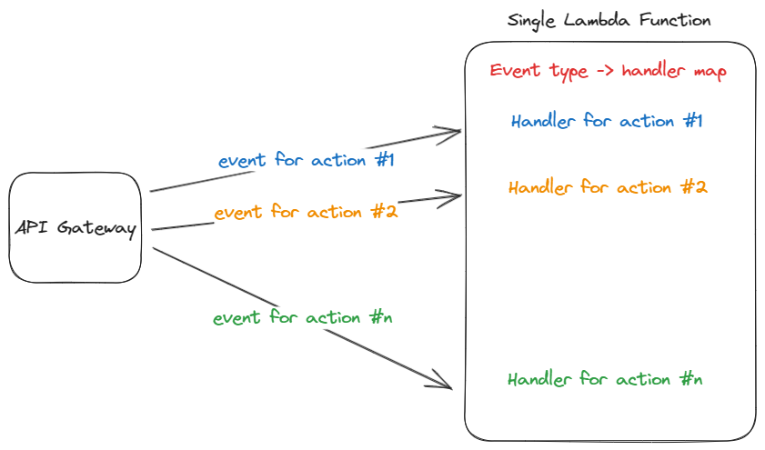
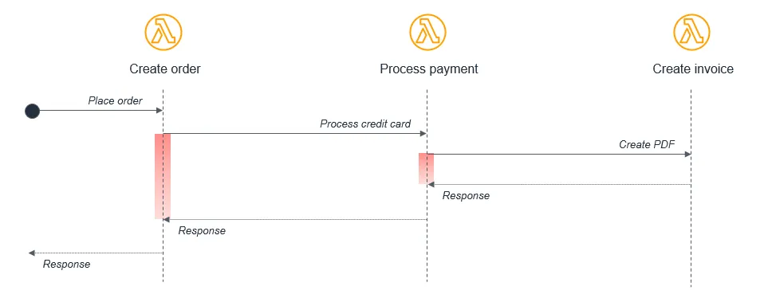

I recently changed teams in the company I am working for, and I was pleased to learn that once in 2 weeks, a member of the team had to come up with a tech-related topic and give a talk about to the rest of the team.

I took that opportunity, and decided to talk about all of the different ways we suck (PC equivalent is “can improve”) at writing a lambda-based application and suggested some action items (that obviously went for the backlog for some time to chill).

Nonetheless, I think there’s a great value in fixing these bad practices, as they affect real metrics such as cost and performance, and the developers will to live.

Anyway, let’s get into it.

## Pitfall #1: Lambda Monolith

I put it first, since that’s the one pattern I have the strongest feelings for (hate in simple terms). Making lambda monoliths is so easy and tempting but the results are truly hideous.

What is a lambda monolith? Imagine a lambda that can be invoked with different types of events and do different things depending on the event.

Each event has its own handler, and there’s a mapping between the event type and the handler.



Besides the known disadvantages of using a monolithic architecture, there are more disadvantages to consider when talking about a lambda monolith.

### Overly Privileged Lambdas
In AWS, you manage permissions via IAM roles, and it’s a best practice to give the least number of permissions to a service in order for it to function.

In case of a lambda monolith, it might be harder to follow that practice, since for example, action #1 might only require S3 access, while action #2 only require RDS access.
In that case, the lambda monolith, will have both S3 and RDS access permissions.

The larger the permission set, the bigger the attack surface is.

### Cold Start & Deployments
The bigger the lambda monolith, the longer it takes to cold-start, and to deploy new versions.

### Memory Configurations
When creating a lambda, you have to specify how much memory it should have, and the more memory it has, the bigger the price per 1ms of execution.

Imagine a scenario where action #1 is fairly simple and doesn’t require much memory, so you go with the lowest tier.
The problem is, action #2 is memory consuming and consistently getting OOM (Out of Memory) errors, so you bump the memory configuration - resulting in higher costs for all different actions in your lambda monolith.

This can drastically affect your lambda costs, depending on the action that is the most memory consuming.

### Monitoring & Debugging
Since you have one big lambda monolith, it is harder to understand what kind of action failed when the lambda reports a failure.

You don’t get granular monitoring OOTB (out of the box) per action, but per lambda. meaning that if you want to see the number of invocations and execution time of your lambda it will be aggregated across all of the different actions, and it will be harder to understand the specific metric properties per action (which is far more valuable).

Of course, you can try and use your monitoring & tracing tool SDK in order to create some sort of a label for each action, but come on, it shouldn’t be that hard.

### Solution
The only solution here is to separate the lambda monolith into multiple lambdas using the strangler pattern. have one event type, and one action per lambda.

This is not only a good practice to make your software “cleaner”, but also has real effects on your lambda performance and cost.

## Pitfall #2: Lambdas Calling Lambdas

To emphasize, the real problem happens when a lambda is synchronously calling another lambda, and essentially waits for its result in order to continue its own execution.

Let’s look at an example from AWS documentation.



In the above example, the lambda responsible for creating the order synchronously calls the process payment lambda, which synchronously calls a create invoice lambda.

This flow is perfectly fine in a single application on a server, but for a distributed serverless architecture there are a few problems to consider.

### Cost
With lambda, you pay for execution duration, every additional 1ms of invocation duration means a bigger bill.

The problem with the above pattern, is that when the create order lambda is waiting for the process payment lambda response, you are paying for the execution time of both, and the same goes for the create invoice lambda - the waiting time for a response also counts for the bills even though the waiting lambda didn’t do work.

### Bottleneck
When using this pattern, the slowest task, like processing payments, can hold up the entire workflow, including faster tasks like creating invoices.

### Error Handling
Since the lambdas are calling each other, all error handling & retries should be handled by each caller lambda.

### Solution
According to AWS docs, there are two ways to overcome this pattern.
One is by using SQS between the lambda functions, that way we decouple the lambdas so that they don’t become a bottleneck for each other, while also reducing the costs.

Another approach would be to use Step Functions, which a is a serverless orchestration service that can robustly handle the errors and retries of the lambdas.

That way the lambda can contain only the business logic.

It is also common to combine between the approaches, and have a Step Function orchestrating the workflow, that includes SQS between lambdas.

## Pitfall #3: Idempotency

One of the design principles of Lambda is idempotency. This means that receiving the same event multiple times does not change the result beyond the first time the event was received.

Since there’s no guarantee that the same event will be sent only once to a lambda, it is critical that you design your function to be idempotent.

Let’s take a simple example of a lambda, which is responsible for adding users to your DynamoDB table. Given a username and id, your lambda adds it to the Users table, as follows.


```python
import boto3

dynamodb = boto3.resource('dynamodb')
table = dynamodb.Table('Users')

def lambda_handler(event, context):
    user_id = event['user_id']
    user_name = event['user_name']
    
    table.put_item(
        Item={
            'UserId': user_id,
            'UserName': user_name
        }
    )
```

The problem here is that if the same event goes into the lambda twice, you will have data duplication in your DynamoDB table.

To fix it, you’d change your code as follows.

```python
def lambda_handler(event, context):
    user_id = event['user_id']
    user_name = event['user_name']
    
    table.put_item(
        Item={
            'UserId': user_id,
            'UserName': user_name
        },
        ConditionExpression='attribute_not_exists(UserId)'
    )
```

That was a pretty simple example, and it might not seem critical if in that case there’s data duplication, but I think that if you take a close look at your systems, you will find multiple places where idempotency is critical, so make sure you design for its.

---

Anyway, these are 3 pitfalls I often encounter in lambda-based applications, obviously there are more, and I will leave some links for further reading in the references section.


## References

* [Anti-patterns in Lambda-based applications - AWS Lambda (amazon.com)](https://docs.aws.amazon.com/lambda/latest/operatorguide/anti-patterns.html)

* [Handling Lambda functions idempotency with AWS Lambda Powertools | AWS Compute Blog (amazon.com)](https://aws.amazon.com/blogs/compute/handling-lambda-functions-idempotency-with-aws-lambda-powertools/)

* [Design principles - AWS Lambda (amazon.com)](https://docs.aws.amazon.com/lambda/latest/operatorguide/design-principles.html)


<!-- PROMO BLOCK -->
---

**Too busy to read tech books?**  
Join my [Telegram channel](https://t.me/booksbytes) for bite-sized summaries and curated posts that save you time while keeping you up to date with essential insights!  
**DISCLAIMER: NO LLM SUMMARIES**

---
<!-- END PROMO BLOCK -->

