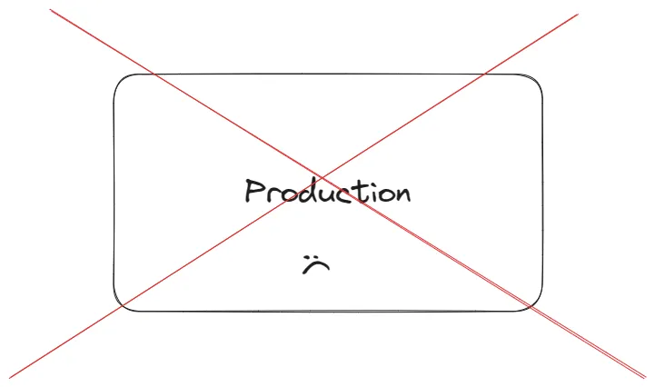

As a software engineer, some days are more stressful than others, but the most stressful days are the days you manage to break production.

You have merged your pull request, happily moving your JIRA ticket to ‘Done’ and you get that little shot of dopamine.

All of that goes out the window, as soon as you get tagged on an alert channel.

In this post, I will share with you a personal experience of how I managed to break production, essentially causing downtime, by merging a short and simple database migration.

## The Product & Task

It’s a security product, we scan your files looking for violations.
If we found some, we will save them to our database as a Violation entity.
Once it is saved in the DB, you can see all your violations in the UI.

My task was to add a new column to that Violation entity, simple as that.

How could anything go wrong, right? wrong!

## I am not a fan of ORMs

Despite their advantages, I still seem to prefer raw SQL, but that’s a topic for a different post.

We used [TypeORM](https://typeorm.io/) which is an ORM for Typescript.

The way you define entities with TypeORM is as follows

```typescript
@Entity()
export class User {
    @PrimaryGeneratedColumn()
    id: number

    @Column()
    firstName: string

    @Column()
    lastName: string

    @Column()
    age: number
}
```

Which corresponds to a table called User with columns id, firstName, lastName, and age.

The thing is, our convention was snake_case for the database columns, and the Typescript naming convention is camelCase.

Meaning that the above code wouldn’t work in our case, we will need to create a naming mapping between the name of the column in the DB and the name of the variable which corresponds to that column in the TypeORM entity.

It is supported pretty easily with the following code.

```typescript
@Entity()
export class User {
    @PrimaryGeneratedColumn()
    id: number

    @Column({ name: 'first_name' })
    firstName: string

    @Column({ name: 'last_name' })
    lastName: string

    @Column()
    age: number
}
```

This way, when we serialize/deserialize a row, the value of the column first_name is assigned to the variable firstName despite the naming convention difference.

## The Bug

If you recall, we have that TypeORM entity called Violation and my task was to add a column to it.

There are two steps:

Create a database migration to add the column

Add the column in the TypeORM entity

Adding a column is easy! I went on the write the simple migration.

```sql
ALTER TABLE Violation ADD COLUMN new_column VARCHAR(255);
```

Then, went to the TypeORM Violation entity and added the column too.

```typescript
@Entity()
export class Violation {
    ....

    @Column()
    newColumn: string;

    ...
}
```

Opened PR, merged, done! right? wrong!!

After around 30 minutes, when my code was deployed, I got tagged on an alert channel of a different team - scary.

The alert? cannot find column newColumn.

Reading the alert again and again, I am slowly realizing how badly my bug is affecting production, and wow that’s a bad feeling.

We couldn’t read any new violations from the table, since all deserializing operations failed due to the unknown column.

At the very least, I knew immediately how to fix it, and after roughly one hour everything went back to normal (my heart rate too).

The fix:

```typescript
@Entity()
export class Violation {
    ....

    @Column({ name: 'new_column' })
    newColumn: string;

    ...
}
```

## Prevention

How could we have prevented it?

More eyes on the PR? meh, that’s no guarantee.

We added a rule to our linter that prevents TypeORM columns to exist without the naming mapping.

And that’s what you should do too, if you have a similar use case.

---

## Why am I telling you this?

Maybe just to encourage you, if you made a stupid mistake causing some major production bug, so did I, and every other software engineer at some point in time, and probably more than once.

As long as you learn from that mistake and make sure you never repeat it, you are on the right path.


<!-- PROMO BLOCK -->
---

🚨 Become a better software engineer. practice building real systems, get code reviews, and mentorship from senior engineers.
Get started with [404skill](https://404skill.github.io/#/)
<!-- END PROMO BLOCK -->


