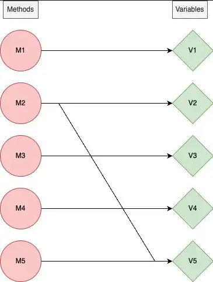
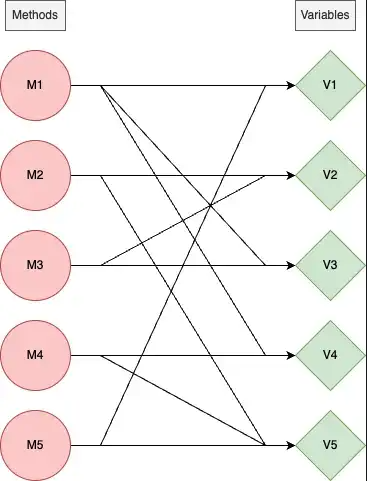

Modularity is a must for good software design. It helps with extensibility, readability, maintainability, and more. It certainly isn’t easy to make your code modular, but what exactly is modularity, and how do we measure it?

## Definition
Modularity describes a logical grouping of related code, which could be a group of classes or functions. [1]

Modularity measures how well your code is separated into different modules or chunks of functionality. The more modular your code is, the easier it will be to change. Making your code modular isn’t an end, but a means to an end: you want to make it easier for others (including yourself) to understand what your code does and how it works.

## How do we measure modularity?
There are more than a few useful metrics to measure modularity.
In this series, I’ll do my best to help you understand cohesion, coupling, and connascence.

This part will focus on cohesion, let’s go.

## Cohesion
In the book Fundamentals of Software Architecture, Mark Richards and Neal Ford define what is a cohesive module.

A cohesive module is one where all the parts should be packaged together, because breaking them into smaller pieces would require coupling the parts together via calls between modules to acheive useful results. [1]

Let’s start with a simple class example

``` python
class C:
  def __init__(self):
    self.a = 1
    self.b = 2
  def do_a(self):
    func(self.a)
  def do_b(self):
    func(self.b)
```

The above class is not cohesive. Why?
Since its functionality can be broken into two separate classes without affecting the results.

In order to make this class cohesive, we can split it into two classes that don’t contain variables that are excessive to some methods (variable a is excessive to method do_b, and variable b is excessive to method do_a).
``` python
class A:
  def __init__(self):
    self.a = 1
  def do_a(self):
    func(self.a)
class B:
  def __init(self):
    self.b = 2
  def do_b(self):
    func(self.b)
```

Building on top of this example, we can illustrate this in a graph.
Consider a class, all of its methods and variables will be vertices.

There’s an edge between the method vertex, M1, and the variable vertex, V1 if M1 uses V1.

For example, consider this scenario where we have 5 methods and 5 variables in a single class.

Method 1 uses only variable 1  
Method 2 uses both variable 2 and variable 5  
Method 3 uses only variable 3  
Method 4 uses only variable 4  
Method 5 uses only variable 5  

From the above scenario, we can generate the following graph



We can deem this class non-cohesive because most methods can be split up into different classes as we did with the first code example. (for example, Method 1 doesn’t use variables 2–5 so there’s no benefit to keeping them under the same class)

In contrast, a cohesive class would have a graph with far more edges, for example



More edges mean that each method uses more variables and splitting up is harder/less efficient/impossible.

## How do we measure cohesion?
Now that we have a rough idea of what cohesion means, let’s formalize how we measure it.

Given n methods M1, M2, …, Mn contained in a class C1 which also contains a set of instance variables { Ai }. Then for any method Mi we can define the partitioned set of

P = {(Ai, Aj) | Ai ∩ Aj = φ}
Q = {(Ai, Aj) | Ai ∩ Aj ≠ φ}

then **LCOM** = |P| — |Q|, if |P| > |Q|

=0 otherwise

LCOM is a count of the number of method pairs whose similarity is zero. [2]

Let’s break this definition down with both of the graph examples.

first example:  
A1 = { V1 }  
A2 = { V2, V5 }  
A3 = { V3 }  
A4 = { V4 }  
A5 = { V5 }  

A5 ∩ A2 = { V2}  
And all other intersection results in empty sets, meaning that:  
|P| = 9, |Q| = 1  
LCOM = 8

second example:  
A1 = { V1, V3, V4 }  
A2 = { V2, V5 }  
A3 = { V2, V3 }  
A4 = { V4, V5 }  
A5 = { V1, V5 }  

|P| = 3, |Q| = 7
LCOM = 0

LCOM = 0 indicates a cohesive class.

LCOM > 0 indicates that the class needs or can be split into two or more classes, since its variables belong in disjoint sets. [2]

From the above example, we can understand that the cohesiveness of a class/module is a gradient, and not necessarily a yes/no question.

Mostly, in order to effectively use this metric, you set a threshold for cohesiveness — for example, if LCOM > 20 we regard the class as non-cohesive, otherwise the class is cohesive.

## References
[1] Fundamentals of Software Architecture, by Mark Richards, Neal Ford

[2] Chidamber, S., R., Kemerer, C., K., A Metrics Suite for Object Oriented Design, IEEE Trans. on Software Eng., Vol.20, №6, June 1994.


<!-- PROMO BLOCK -->
---

**Too busy to read tech books?**  
Join my [Telegram channel](https://t.me/booksbytes) for bite-sized summaries and curated posts that save you time while keeping you up to date with essential insights!  
**DISCLAIMER: NO LLM SUMMARIES**

---
<!-- END PROMO BLOCK -->

