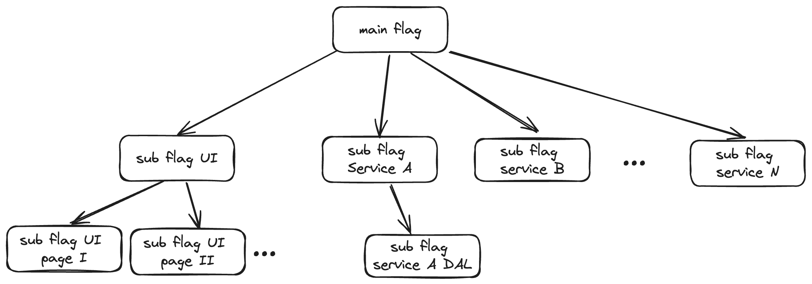

Feature flags solutions are pretty established by now, but I feel like there are some key features missing that would make me switch vendors.

I mainly have two problems with current solutions:
1. It can get tedious and messy to turn on/off a feature when multiple FFs were placed for it
2. Your codebase becomes a FF graveyard if you don't remember cleaning it, and you probably don't...

To solve these issues I have two suggestions:

1. FF Trees! I want to be able to create connections between flags. I want to have a main flag (per feature for example), and connect to it different "sub-flags" that control the flow inside different services and the UI.
Once I turn on/off the main flag I expect all flags to be turned on/off accordingly, so that I can easily roll out or rollback an entire feature while changing a single flag.

This is probably an extreme example, but I have had the pleasure to work on projects where I needed to turn on 4-5 FFs in order to test a feature e2e, and it definitely gets messy.

> "oh sh*t I missed that one UI FF, that's why I don't see anything in the page"   
>  -many developers around the world after debugging the feature flags spaghetti in their codebase.

This feels like a natural addition to current solutions IMO - I encourage you to poke holes in it.

---

2. Send notifications of inactive / fully open FFs

I don't want to create myself JIRA tickets to remove the FFs checks from the code once the feature is out in the wild just to forget about them months later after the feature was released.

These dead branches in the code are such a pain... and it makes debugging much harder - I hate it. Just tell me when I can remove it, fire up some webhook that I can integrate to my slack so that the weekly on-call can take that as a task or something come on...

The FFs I want to remove are
1. Inactive - I didn't query for their values in the last X days
2. Fully open - roll out is done, the feature flag is set to true without any rules attached and Y days have passed since then.

That's it, these are the features I miss the most about feature flags solutions as of Feb 2024.

---

- Do you also experience the problems I described? if so, did you solve them with internal tools? 

- Do you think a new player in the FF market can grab some market share by implementing these two features along the basic functionality?

