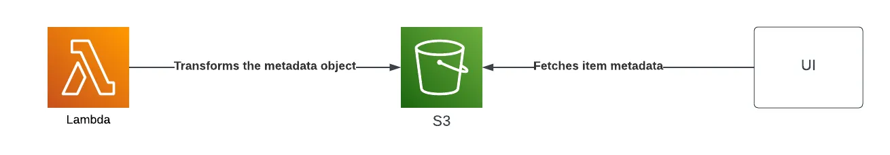
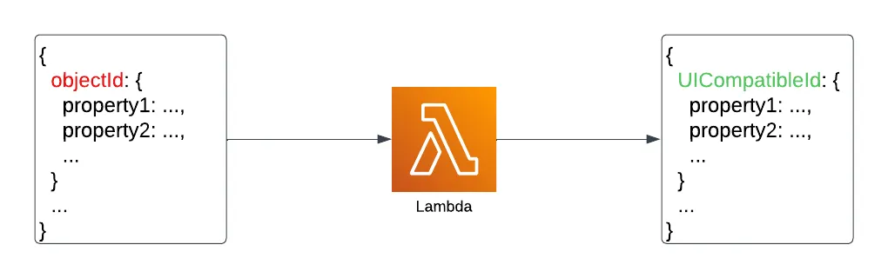
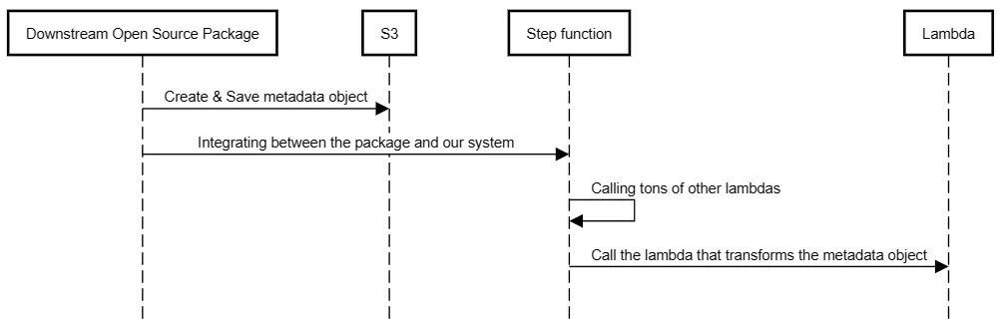

I recently wrote about the [AWS Lambda bad practices](https://www.16elt.com/2023/07/12/aws-lambda-pitfalls/), and one of them was a bit more personal for me than the others.

In that post, I talked about how lambda should be idempotent because there’s no guarantee an event will be sent out only once in some cases.

This is the story about how violating this practice can cause horrible bugs which take days to reproduce and make sense of.

I’ll go over the issue itself, and how I managed to debug it in non-standard ways, but first you will need some context of the system we are working on.

---

#### Alignment
Idempotency is a trait of an operation.
An idempotent operation is an operation that, if applied multiple times, doesn’t change the result beyond the first result.

To illustrate, the bellow addition function is idempotent.

```python
def (a, b):
  return a + b
```

And the following is an example of a function which is not idempotent.

```python
def add_one(num):
    return num + 1
```

## Application Introduction

The application has 3 important parts - The UI, S3, and Lambda.
In S3, we have an object which stores metadata about an item.
The object is of the following structure.

```
{
  objectId: {
    property1: ...,
    property2: ...,
    ...
  },
  ...
}
```

The lambda was partly responsible for transforming that metadata object, and the UI was consuming it and rendering the metadata properties of an item.



There’s just a single complication - the object ids we used as keys for the metadata object had two formats.

Essentially, each item had an id coming from a downstream package we developed, and another id that we showed in the UI.

Meaning that there was a mapping between these different id formats, and the lambda was responsible for transforming the metadata object to contain the UI-compatible ids.



## The Nasty Bug

It was a chill morning, before I got tagged on that massive Slack thread, and asked to take a look at a weird behavior in production.

I know that area well, I thought, one hour and I am back to doing whatever I was doing before, calmly.

Little did I know, I was about to spend a few days solving it.

The Bug: Users have complained that some of their items don’t have any metadata.

Well, there’s one S3 object and a single lambda that can be responsible for that, or so I thought.
I looked around, no recent code changes, the code that does the transformation isn’t new, it was always working, why would it break now out of nowhere?

## Debugging

At that point, I have to say that I haven’t even considered idempotency to be the reason for that bug - so I was looking for other places in the flow that might have changed the same object.

The problem? that’s the flow (roughly)



Essentially, between creating the metadata object in the downstream package, and transforming it in the lambda, there were tons of other lambdas that were invoked.

I started looking for all the lambdas in the middle that had access to that S3 object, it didn’t minimize the search pool by much, so I started diving into the code, looking for any puts or posts for S3.

I did that for a few lambdas until I realized it is going to take too long. I have to find a faster way to understand who’s responsible for changing that object.

## Debugging 2.0

After spending a day trying to reproduce or make some sense of the issue, I haven’t made any real progress.

Instead of me looking for lambdas that might have changed the object in S3, I figured that S3 can just tell me which lambda changed the object via S3 notifications.

I set up an S3 notification for objects created events and applied filtering by prefix and suffix so that the event match exactly the object I looked for.
I created an SQS which will receive these notifications from S3 and that was it!

With that setup ready, I triggered the flow, hopeful that I am close to solving this, then I saw a surprising result.

A few messages arrived in the queue, where I was expecting only one. Each message contained the IAM role name of the lambda that had modified the S3 object.

I opened these events, first access - S3 object modified from the transformation lambda - 50KB size

second access - S3 object modified from the transformation the transformation lambda (once again!!) - 0KB size.

> “WTF?”

## Idempotency is Important

Realizing the same lambda was invoked twice with the same event, focused my attention on the function inside that lambda that is doing the id translation.

After reading the function, everything made sense, this function was clearly not idempotent, and calling it twice would result in an empty object - which explains why the S3 object size was 0KB after the second access, and why there were missing metadata in the UI!

To illustrat this in code, the translation function was equivalent to the following function.

```python
def transform_keys(mapping, obj):
    transformed = {}
    for key in obj.keys():
        if key in mapping:
            transformed[mapping[key]] = obj[key]

    return transformed
```

Assuming the following mapping

```
mapping = {
    "id_format_1_1": "id_format_2_1",
    "id_format_1_2": "id_format_2_2",
}
```

And the below object

```
obj = {
    "id_format_1_1": "value1",
    "id_format_1_2": "value2",
}
```

Then let’s execute the following.

```python
transformed_once = transform_keys(mapping, obj)
transformed_twice = transform_keys(mapping, transformed_once)

print(f"Transformed once result: {transformed_once}")
print(f"Transformed twice result: {transformed_twice}")
```

And the results are already known.

```
Transformed once result: {'id_format_2_1': 'value1', 'id_format_2_2': 'value2'}
Transformed twice result: {}
```

---

At this point, it was pretty straightforward to find the correct fix and call it a day, the bug is solved.

## Note

Just to be technically accurate, usually when you are referring to the idempotency principle in lambdas you wary of the possibility that an event will be passed more than once, and it is a pretty random event.

In our case, there was a different issue in our system that led the event to arrive twice at the lambda consistently.

## Summary

Idempotency is a real concern, debugging related issues is difficult, and you should design your function to be idempotent from the get-go.

Personally, I feel like solving this bug matured me as an engineer since I had to be more resourceful than usual with my debugging skills.


<!-- PROMO BLOCK -->
---

**Too busy to read tech books?**  
Join my [Telegram channel](https://t.me/booksbytes) for bite-sized summaries and curated posts that save you time while keeping you up to date with essential insights!  
**DISCLAIMER: NO LLM SUMMARIES**

---
<!-- END PROMO BLOCK -->

