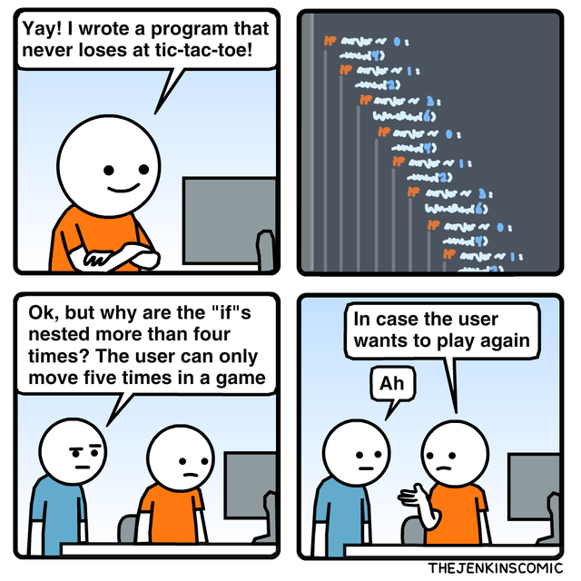

I believe that the downsides of overly nested code are well known and covered, it mainly revolves around readability and maintainability, and I won’t go into more details in regards to that.

I’d like to focus on the techniques to flatten an overly nested code, but before doing so, you should keep in mind that flattening your code isn’t always the answer, as it has some disadvantages as well, for example:

Expressiveness: In some situations, nested code can more accurately reflect the logical structure of the problem being solved.

Loss of context: When flattening code, you may end up creating multiple small functions, which can make it harder to follow the flow of logic and understand the context in which these functions are called. This might lead to a situation where developers need to jump between functions to grasp the entire process, which could decrease readability.

---




## The Problem: Overly Nested Code

Consider the following Python code, which processes a list of data items and extracts a list of tuples containing the id and tag of each item based on specific conditions:

The value of the item must be greater than a given threshold.
The category of the item must be either “A”, “B”, or “C”.
The tags field must be present in the item.
The extracted tag must start with the string “important”.

```python
def process_data(data, threshold):
    result = []
    for item in data:
        if item["value"] > threshold:
            if item["category"] in ["A", "B", "C"]:
                if "tags" in item:
                    for tag in item["tags"]:
                        if tag.startswith("important"):
                            result.append((item["id"], tag))
    return result
```

While this code works, its deeply nested structure makes it hard to read, maintain, and debug. Let’s improve it by applying three flattening strategies.

### Step 1: Embrace early returns
Reduce nesting by using early returns to exit loops or skip iterations when a condition isn’t met.

```python
def process_data(data, threshold):
    result = []
    for item in data:
        if item["value"] <= threshold:
            continue
        if item["category"] not in ["A", "B", "C"]:
            continue
        if "tags" not in item:
            continue
        for tag in item["tags"]:
            if tag.startswith("important"):
                result.append((item["id"], tag))
    return result
```

### Step 2: Break it down
Divide the deeply nested code into smaller, more digestible functions or components. This promotes modularity and makes it easier to test and debug.

```python
def filter_item(item, threshold):
    return item["value"] <= threshold or item["category"] not in ["A", "B", "C"]:

def process_tags(item):
    result = []
    for tag in item["tags"]:
        if tag.startswith("important"):
            result.append((item["id"], tag))
    return result

def process_data(data, threshold):
    result = []
    for item in data:
        if filter_item(item, threshold):
            result.extend(process_tags(item))
    return result
```

### Step 3: Rethink your logic
Sometimes, a simple change in your approach can reduce nesting. For example, try using maps, filters, or reducers instead of nested loops.

```python
def filter_item(item, threshold):
    return item["value"] > threshold and item["category"] in ["A", "B", "C"]

def important_tags(item):
    return [(item["id"], tag) for tag in item["tags"] if tag.startswith("important")]

def process_data(data, threshold):
    return [tag for item in data if filter_item(item, threshold) for tag in important_tags(item)]
```

In the final refactored code, we’ve flattened the nesting using early returns, broken it down into smaller functions, and rethought the logic using list comprehensions. The code is now more readable, maintainable, and easier to test.


<!-- PROMO BLOCK -->
---

**Too busy to read tech books?**  
Join my [Telegram channel](https://t.me/booksbytes) for bite-sized summaries and curated posts that save you time while keeping you up to date with essential insights!  
**DISCLAIMER: NO LLM SUMMARIES**

---
<!-- END PROMO BLOCK -->


