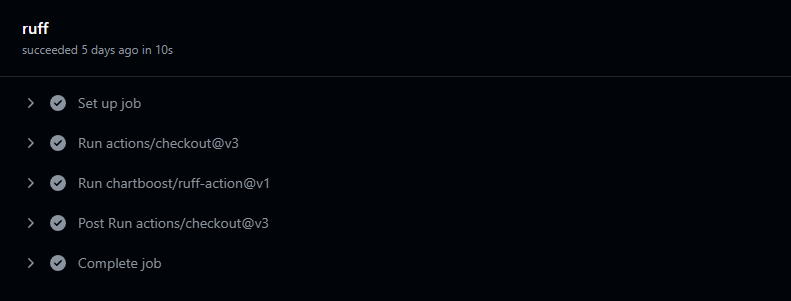
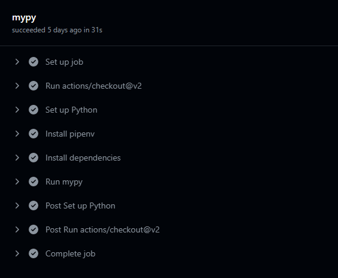

I work with open-source & private Python projects on GitHub on a daily basis.  
I use Github Actions to run my tests, linting, static type checking, and other CI/CD tasks.  

In this short guide I wanted to share my go-to tools and configurations for setting up my projects.
Here, I will mostly focus on setting up linting with [ruff](https://github.com/charliermarsh/ruff) and static type checking with [mypy](https://github.com/python/mypy).

The main goal is to be able to run both ruff and mypy on every pull request, and every push to the main branch.
Additionally we would want to be able to run these tools locally, with the same configuration so that we get consistent results locally & remote.


## Step 1 - Install dependencies

I personally love using pipenv, so in that case create/open a Pipfile in the root of your project and copy the following contents:

```python
[[source]]
url = "https://pypi.python.org/simple"
verify_ssl = true
name = "pypi"

[dev-packages]
ruff = "*"
mypy = "*"
```

This basically specifies that our project has two dev dependencies of latest ruff & mypy.

In order to install these dependencies, simply run `pipenv install --dev`.

## Step 2 - Configure the tools

As one of our goals was to have consistent results between remote & local executions, I like having a configuration file for all of the tools, which means I like having a `pyproject.toml`.

Create/open your `pyproject.toml` file in the root of your project and copy the following contents:

```python
[tool.mypy]
strict = true

[tool.ruff]
# Enable pycodestyle (`E`) and Pyflakes (`F`) codes by default.
select = ["E", "F"]
ignore = []

# Allow autofix for all enabled rules (when `--fix`) is provided.
fixable = ["A", "B", "C", "D", "E", "F", "G", "I", "N", "Q", "S", "T", "W", "ANN", "ARG", "BLE", "COM", "DJ", "DTZ", "EM", "ERA", "EXE", "FBT", "ICN", "INP", "ISC", "NPY", "PD", "PGH", "PIE", "PL", "PT", "PTH", "PYI", "RET", "RSE", "RUF", "SIM", "SLF", "TCH", "TID", "TRY", "UP", "YTT"]
unfixable = []

# Exclude a variety of commonly ignored directories.
exclude = [
    ".bzr",
    ".direnv",
    ".eggs",
    ".git",
    ".hg",
    ".mypy_cache",
    ".nox",
    ".pants.d",
    ".pytype",
    ".ruff_cache",
    ".svn",
    ".tox",
    ".venv",
    "__pypackages__",
    "_build",
    "buck-out",
    "build",
    "dist",
    "node_modules",
    "venv"]

line-length = 120
```

To read more about the configurations options, refer to the respective docs:
* [ruff configuration docs](https://beta.ruff.rs/docs/configuration/)
* [mypy configurations docs](https://mypy.readthedocs.io/en/stable/config_file.html)


## Step 3 - Setting up a remote workflow with GHA
After step 2, you should be able to run both ruff & mypy locally.
Now you will set an automatic workflow on GitHub, which will run ruff & mypy whenever a PR is opened and/or there was a push to the main branch.

Create a file `linting_and_type_check.yaml` under `.github/workflows` and copy the following contents:

```yaml
name: lint_and_type_check
on:
  push:
    branches:
      - main
  pull_request:
jobs:
  ruff:
    runs-on: ubuntu-latest
    steps:
      - uses: actions/checkout@v3
      - uses: chartboost/ruff-action@v1

  mypy:
    runs-on: ubuntu-latest
    steps:
      - uses: actions/checkout@v2

      - name: Set up Python
        uses: actions/setup-python@v2
        with:
          python-version: 3.8

      - name: Install pipenv
        run: pip install pipenv

      - name: Install dependencies
        run: pipenv install --dev

      - name: Run mypy
        run: pipenv run mypy .
```

If the above syntax is a bit mysterious, you can go through the [syntax docs](https://docs.github.com/en/actions/using-workflows/workflow-syntax-for-github-actions). 

As soon as you will push the above file, you will see the actions being triggered.
Verify that both ruff and mypy executed successfully, and that they have consistent results with your local executions.

On GitHub, it should look like the following





---

Feel free to tweak this process with your own favorite tools, and if you have any questions you can reach out to me on [twitter](https://twitter.com/_eltur).


<!-- PROMO BLOCK -->
---

**Too busy to read tech books?**  
Join my [Telegram channel](https://t.me/booksbytes) for bite-sized summaries and curated posts that save you time while keeping you up to date with essential insights!  
**DISCLAIMER: NO LLM SUMMARIES**

---
<!-- END PROMO BLOCK -->


