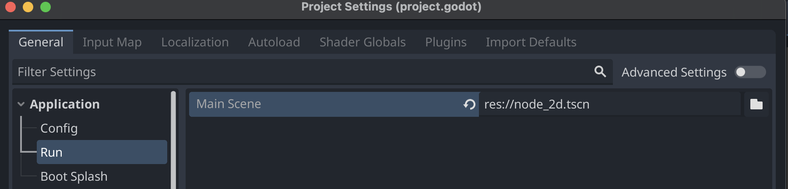
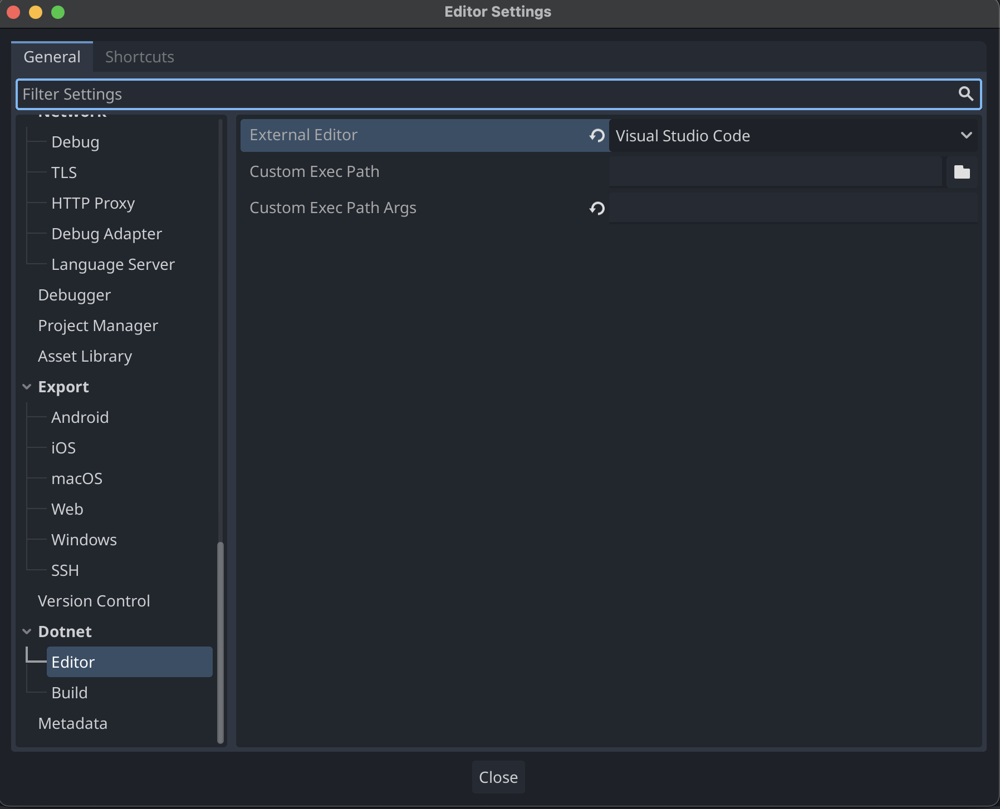

I spent some time trying to set up my dev environement to be able to run and debug a Godot game written in .Net inside VSCode.
Here are the steps I took to setup:

1. Install Godot Engine for **.Net** [Link](https://godotengine.org/download/macos/)
2. Install .Net SDK [Link](https://dotnet.microsoft.com/en-us/download)
3. Go into VSCode and install the following extensions
    * .NET Install Tool
    * C#
    * C# Dev Kit
    * C# Tools for Godot
4. In the Godot Engine, click on **Project** -> **Project Settings**, then on the sidebar under **Application**, click on **Run** and set a main scene.



5. In the Godot Engine, click on **Editor** -> **Editor Settings**, then scroll down on the sidebar, under **Dotnet** click on **Editor**, and change the external editor to VSCode.



6. Open your project in VSCode, you will need to add two files in order to debug and run your game from VSCode.
Create a `.vscode` folder, with two files, `launch.json` and `tasks.json`

launch.json:

```json
{
    "version": "2.0.0",
    "configurations": [
        {
            "name": "Launch",
            "type": "coreclr",
            "request": "launch",
            "preLaunchTask": "build",
            "program": "{env:GODOT4}",
            "cwd": "${workspaceFolder}",
            "console": "internalConsole",
            "stopAtEntry": false,
            "args": [
                "--path",
                "${workspaceRoot}"
            ]
        },
        {
            "name": "Launch (Select Scene)",
            "type": "coreclr",
            "request": "launch",
            "preLaunchTask": "build",
            "program": "{env:GODOT4}",
            "cwd": "${workspaceFolder}",
            "console": "internalConsole",
            "stopAtEntry": false,
            "args": [
                "--path",
                "${workspaceRoot}",
                "${command:godot.csharp.getLaunchScene}"
            ]
        },
        {
            "name": "Launch Editor",
            "type": "coreclr",
            "request": "launch",
            "preLaunchTask": "build",
            "program": "{env:GODOT4}",
            "cwd": "${workspaceFolder}",
            "console": "internalConsole",
            "stopAtEntry": false,
            "args": [
                "--path",
                "${workspaceRoot}",
                "--editor"
            ]
        },
        {
            "name": "Attach to Process",
            "type": "coreclr",
            "request": "attach"
        }
    ]
}
```

and tasks.json:

```json
{
    "version": "2.0.0",
    "tasks": [
        {
            "label": "build",
            "command": "dotnet",
            "type": "shell",
            "args": [
                "build",
                "/property:GenerateFullPaths=true",
                "/consoleloggerparameters:NoSummary"
            ],
            "group": {
                "kind": "build",
                "isDefault": true
            },
            "presentation": {
                "reveal": "silent"
            },
            "problemMatcher": "$msCompile"
        }
    ]
}
```

7. Create a new environment variable called `GODOT4`, with its value being the path to your godot executable.
In my case, on a mac, this was the correct path `/Users/eliranturgeman/Downloads/Godot_mono.app/Contents/MacOS/Godot`

---

This might be a beginning of a "dev log" kind of a series, or a one time thing, nobody knows.


