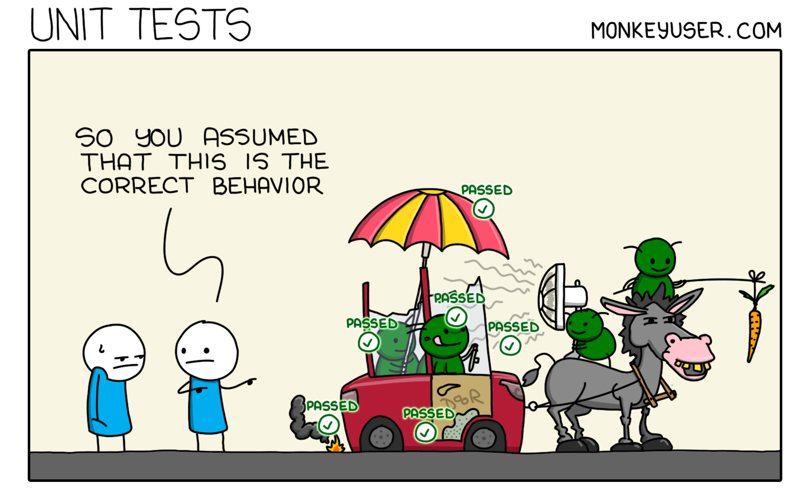

Let’s talk about release schedules. My team had a rollercoaster ride with our release strategy, moving from stressful weekly releases loaded with bugs and merge conflicts to a more smooth (but not perfect), automated releases several times a day. A year later, after too many production incidents, it was decided that we are reverting to weekly releases. It feels like a huge step backward, but let's unpack this.

## The Problem
After some serious customer-impacting incidents, management decided to hit the brakes. They think moving back to weekly releases will make our product more stable. From where I'm standing, this feels like fixing a leaking pipe by turning off the water supply — sure, it stops the immediate problem, but isn’t it just a little extreme?

With daily releases, if something broke, we could fix it fast. Small, manageable updates meant fewer headaches. Now, going back to weekly releases feels like we’re just bundling up problems to deal with all at once.

Honestly, I don't think the release is the problem, but our testing coverage.

## The real problem

We have e2e and unit tests, and some basic API healthchecks, but it's clearly not enough. We need a beefier strategy here.
What kind of strategy? well I'd start with making a list of all of our core behavior (each team should take care of their own ofc) and make sure we cover all of them (we definitely don't right now).

With every new incident that happened, the pattern became more clear... we are sitting in the retro meeting thinking - "oh, we didn't have any test covering that behavior at all, we should add that" - which is fine in a retrospective sense, but I suggest being proactive about it.

So rather than slowing down everything, I think we should fix our weaknesses.
Sure, weekly releases would mmake the product more stable during the week, but developers experience also matters. and the best devex? you write your code, you have many tests that give you confidence when you push to prod, and you push to prod on a daily basis. everything less than that is a compromise.

I'd be even up for a codefreeze in the meantime, so we ensure that the testing efforts are tackled and not pushed back to the backlog.

## Counters

* writing and running more tests costs more

    * Yes, building a robust testing environment takes time and money. But think about the cost of not doing it — losing customers, hurting our reputation, and all the stress of fixing things after they’ve gone wrong. I’d argue that investing in better testing could save us a lot in the long run. And once we’ve set it up, maintaining it isn’t as costly as setting it up.

    * weekly releases can also sink a day's worth of work of a few engineers, on a weekly basis. (which also translates to money)
    * subpar devex can lead to lower devs retention in the org. 

All in all, I think that its a hard decision to make, but I'd argue that in the long term we would have benefited from tests much better than weekly releases.

To conclude, slowing down to weekly releases might seem like a safe move, but it's like putting a Band-Aid on a broken arm. What we really need is to strengthen our processes where they’re weak — especially our testing. Let's not settle for a quick fix that might hold us back in the long run.

<!-- PROMO BLOCK -->
---

**Too busy to read tech books?**  
Join my [Telegram channel](https://t.me/booksbytes) for bite-sized summaries and curated posts that save you time while keeping you up to date with essential insights!  
**DISCLAIMER: NO LLM SUMMARIES**

---
<!-- END PROMO BLOCK -->

