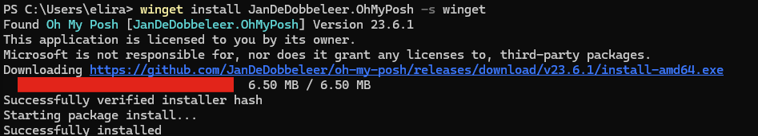
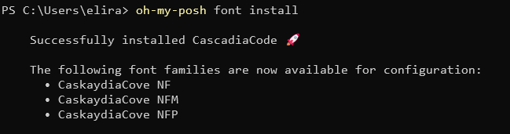
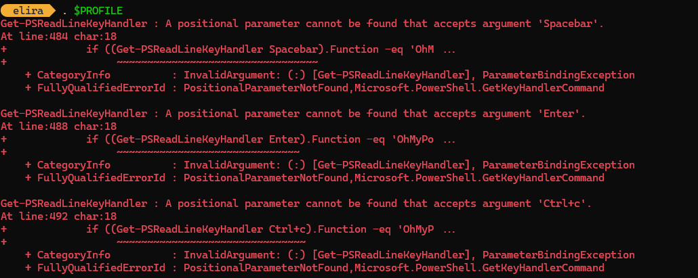
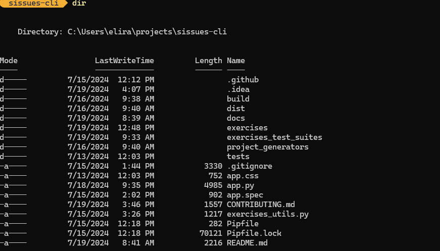
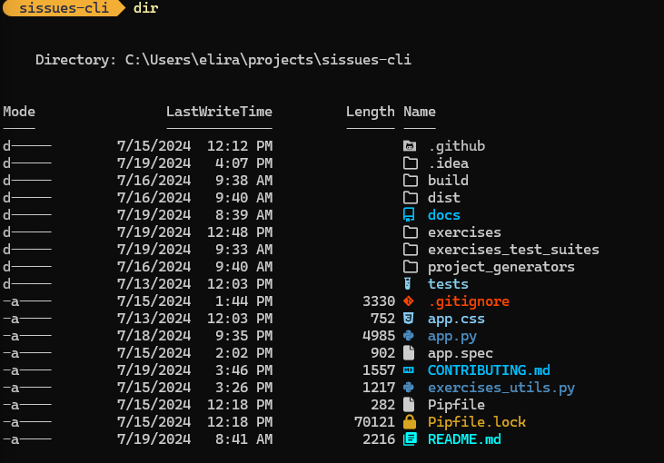
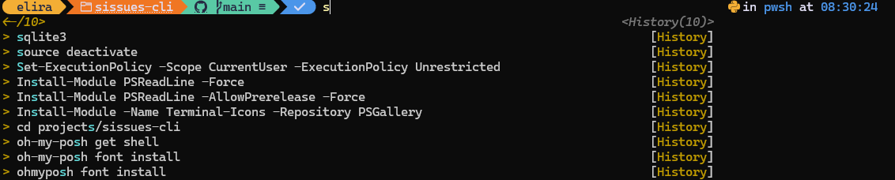
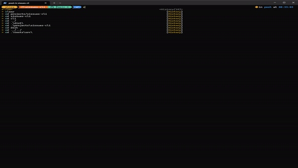

## Step 1: Install Oh-My-Posh

goto [oh-my-posh windows installation page](https://ohmyposh.dev/docs/installation/windows), or just execute the following

```
winget install JanDeDobbeleer.OhMyPosh -s winget
```




## Step 2: Choose a Font
Totally optional, but if you want to get a specific font follow this section.

to install a supported font run the following:

```
oh-my-posh font install
```

I chose `cascadia-code`.



After installation is done click `CTRL + SHIFT + ,` to open the terminal settings

Now add the font.face attribute under the profiles.defaults attribute
(change the font face to the font you downloaded in the previous step.)
```
{
    "profiles":
    {
        "defaults":
        {
            "font":
            {
                "face": "CaskaydiaCove NF"
            }
        }
    }
}
```

## Step 3: Applying oh-my-posh
To apply oh-my-posh shell to our powershell, we will need to adjust our $PROFILE file.

Open your $PROFILE file with 

```
notepad $PROFILE
```

If you get an error that the file doesn't exist - create it first with

```
New-Item -Path $PROFILE -Type File -Force
```

Add this line to the $PROFILE file

```
oh-my-posh init pwsh | Invoke-Expression
```

Save, and then on the terminal run the following command to reload your profile so that the changes take effect

```
. $PROFILE
```


## Step 4: Customizing the prompt

There are many ways where you can customize the prompt.
You can browse themes [here](https://ohmyposh.dev/docs/themes#jandedobbeleer), and look different customizations under `Segments` section in [oh-my-posh docs](https://ohmyposh.dev/docs)

I'm going to go with oh-my-posh's author theme, so what we need to do is change the $PROFILE file again, replacing the line we added there before with the following line

```
oh-my-posh init pwsh --config ~/jandedobbeleer.omp.json | Invoke-Expression
```

Now lets reload our profile again.

If you are unlucky as I am, you might have gotten the below error too, luckily that's simple to solve...



Run the following in powershell administrator mode

```
Install-Module PsReadLine -Force
```

After that, I closed my open powershell session, and when I opened a new one `. $PROFILE` works!

### Step 5: Icons

If you want to add some icons to the dir list follow the following steps

before:



open powershell with administrator rights and execute the following

```
Install-Module -Name Terminal-Icons -Repository PSGallery
```

then open $PROFILE and add the following line

```
Import-Module -Name Terminal-Icons
```

Reload your profile with `. $PROFILE`, and now you have some icons when you execute `dir` / `ls`!



## Step 6: Auto-completion (history-based)

Now when styling is out of the way, lets add autocompleteion based on our command history.

open powershell with administator rights and execute

```
Install-Module PSReadLine -Force
```

now add the following lines to your $PROFILE

```
Import-Module PSReadLine
Set-PSReadLineOption -PredictionSource History
Set-PSReadLineOption -PredictionViewStyle ListView
Set-PSReadLineOption -EditMode Windows
```

and you should have autocompletion working!






<!-- PROMO BLOCK -->
---

Looking for a powerful, self-hosted backend for forms? 
I'm building **Collecto** — a production-ready tool designed to handle your forms with ease and security. [Check it out here](https://github.com/Eliran-Turgeman/Collecto) and be part of its journey!
<!-- END PROMO BLOCK -->


