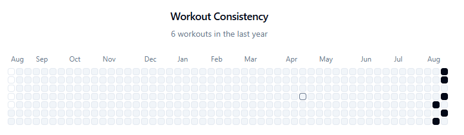
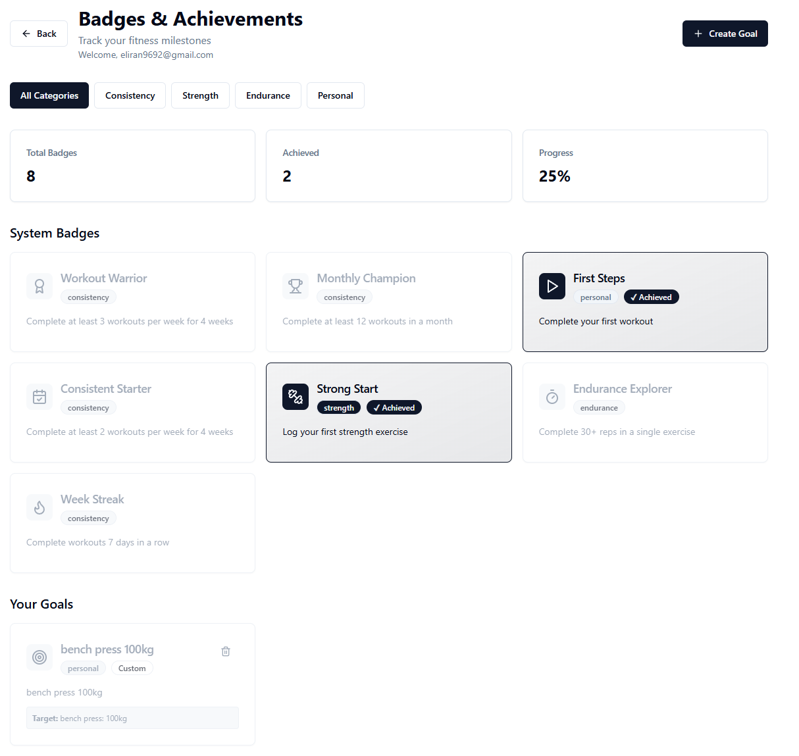

Most people solve their subscription fatigue by canceling Netflix. I solved it by vibe-coding my own workout app instead of paying another SaaS.

Two weeks ago, I decided to get serious about my workouts again and start logging them.
I looked for an existing solution that has the following:
- create workouts
- log sets, reps, and weights
- a calendar to track consistency

simple enough.

Free apps were crammed with ads. Paid apps had bloated features I didn’t want. Both annoyed me.

Before vibe-coding, I’d either tolerate ads or pay. Now there’s a third option - build my own.

Of course, you could always build your own, but pre-vibe-coding it would take much more time to be worth it.

## How did I choose the vibe coding platform?

I logged into loveable, base44, bolt, and wrote the following (imperfect) prompt

```
I want to create a personal webapp for managing my own workout routines (kind of a workout logger)

I want to be able to define "workouts" - collection of exercises including sets and reps 
I want to be able to track which workout i did on which day - calendar view I want to be able to log the weights I did for every exercise in every set.
I want my workout templates to be a simple collection of exercises that are plaintext - don't create some kind of an exercise library.. i just want to type the exercise name myself

make it stateful, including a db connection to store all the relevant data.
```

Whichever tool gave me the best first shot, I ran with. This time it was Loveable.

## Iterating
With that one-shot starting point from loveable, I published it, and went to my first workout at the gym, all excited and ready to use what I built.

First workout: I needed notes for exercises. Another: supersets. Each time I wrote it down, went home, and 15 minutes later I published a new version with loveable.

After two weeks of using this app at the gym and doing tweaks, the app feels solid.

On my last iteration, I added a badges/achievement page, and a github-like consistency widget that looks cool ~~I hope will help me stay on track and be consistent~~.





## Sharing
Friends wanted to try it too - the problem? I didn't make it secured by sign-in, I thought I only need it for myself, and even if someone's going to find this weird loveable URL, they could only see my workouts - who cares...  
But of course for my friends I'll write one more prompt - and so I added Supabase auth within minutes.

## Final Thoughts
This post isn’t about showing off my little workout logger anyone could make in a few hours prompting. It’s about how easy it is today to scratch your own itch.

You build the exact features you need, when you need them. No ads, no bloat, no adapting to someone else’s UX.
Just something comfortable and fun to use.

It’s never been easier to bring your ideas to life, small or big.

